#Manual: Vector Field Analysis

Kota Miura <miura@embl.de>

Centre for Molecular and Cellular Imaging, EMBL Heidelberg

Tel. +49 6221 387 404

Document Date: 2010-10-04

##Main Features

- IgorPro (Wavemetrics)[^1] Procedure.

- Optical Estimation by temporal local optimization.

- Plotting of vectors in the original video frame.

- Filtering of the vectors by image intensity, velocity and direction.

- Image masking.

- Histograms of velocity, directionality.

- Calculation of protein flow rates.

##TOC

1. Introduction
2. [Work Flow](#workflow)
3. Appendix
  1. [Appendix 1](#app1): Checking the average intensity fluctuation
  2. [Appendix 2](#app2): Enhancing Contrast
  3. [Appendix 3](#app3): Checking the shutter timings
  4. [Appendix 4](#app4): Walking average
  5. [Appendix 5](#app5): Preparing Image Mask

------------------------------------------------------------------------------------------------------

#Introduction

The vector field analysis program uses an algorithm that is called the
optical flow estimation (Teklap, 1995). Optical flow is “the
distribution of apparent velocities of movement of brightness patterns
in an image” (Horn and Schunck, 1981). In video sequences the projection
of temporal axis to the *x-y* plane results in an optical flow image.
Since the optical flow is a result of the movement, it contains
information on movement speed and direction. The optical flow estimation
recovers these quantitative measures of the movement, which enables the
statistical treatments of all movement that occurs in the sequence. A
velocity vector field is the calculation result in which every movement,
namely speed and direction, within the sequence is mapped. The largest
difference to the other tracking technique is that this operation does
not require the segmentation step.

Optical flow detection can be categorized into two types in terms of
basic algorithm: the **matching method** and the **gradient method**. In
the **matching method**, displacement is measured by searching for a
particular region in the consecutive frame by matching the pattern of
the previous frame. In the **gradient method**, optical flow is detected
by assuming no changes in the signal intensity pattern at different time
points and by using equations that correlate the spatial and temporal
intensity gradient. This program uses the gradient method. Details are
described elsewhere (Miura, 2005).

Briefly, a general assumption in the gradient method is that the total
intensity of the image sequence is constant:

 (1) 
$$
\frac{\partial I(x, y, t)}{\partial x}u + \frac{\partial I(x, y, t)}{\partial y}v + \frac{\partial I(x, y, t)}{\partial t} = 0
$$   

(2)
$$
\mathbf{v}(u,v)= \mathbf{v}(\frac{dx}{dt},\frac{dy}{dt})
$$

Where $I(x,y,t)$ is the intensity distribution of the image and $\mathbf{v}$ is the optical flow vector. The equation (1) links the partial derivatives of the brightness pattern of the image sequence and the optical flow velocity. Since there are two unknowns, another constraint is required.

The temporal local optimization method (TLO) used in this program assumes that the optical flow field is constant temporally (Fig.6) (Nomura et al., 1991).

(3)
$$
\frac{\partial \mathbf{v}}{\partial t} = 0
$$

The constant vector can be assumed for *N* frames. Then for a stack with frames , following error function can be generated:

(4)
$$
E = \sum_k(I_x(i, j, k)u+I_y(i, j, k)v + I_t(i, j, k))^2
$$

By the least squared method, $\mathbf{v}(u,v)$ can be determined by two equations $\partial E / \partial u = 0$ and $\partial E / \partial v = 0$.

A series of tiff-format image frames is converted to a stack, which is then treated as a three-dimensional matrix $I(x,y,t)$. Partial derivatives of the image sequence must be first calculated as seen in equations 1 and 4. There are three popular ways for obtaining the first-order partial derivatives[^2]; Sobel kernel, Roberts kernel and Prewitt kernel (also is called two-point central difference kernel). The Prewitt kernel was used as follows:

(5a)
$$
\frac{\partial I}{\partial t} = \bigg{[}\sum^1_{i=-1}\sum^1_{j=-1}\big{\{}I(x+i, y+j, t+1) - I(x+i, y+j, t-1)\big\}/2\bigg{]}/9
$$

(5b)
$$
\frac{\partial I}{\partial x} = \bigg{[}\sum^1_{j=-1}\sum^1_{k=-1}\big{\{}I(x+1, y+j, t+k) - I(x-1, y+j, t+k)\big\}/2\bigg{]}/9
$$
(5c)
$$
\frac{\partial I}{\partial y} = \bigg{[}\sum^1_{i=-1}\sum^1_{k=-1}\big{\{}I(x+i, y+1, t+k) - I(x+i, y-1, t+k)\big\}/2\bigg{]}/9
$$

## Work Flow

###Preprocessing

For a successful analysis, following preprocessings are recommended:

1.  Check average intensity fluctuation of the sequence (recommended:
    see [Appendix 1](#app1)).

2.  Generate “Image Mask” using ImageJ (Fig. 1: see [Appendix
    5](#app5)). You might not need this if there is no background area
    in the image.

  - 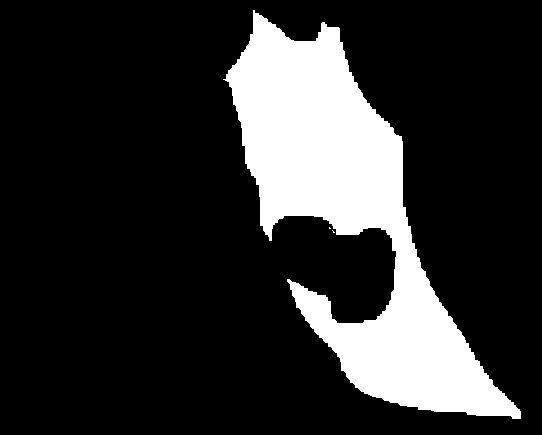
  - Fig.1 The “image filter” should look something like this. White area will be calculated for vector field. Such masking is required since noise in the background causes tiny vectors that contaminate the measurements.

3. Determine the range of frames to use for the Vector Field analysis by inspecting different time points of the stack. Check the shutter timing as well ([App.3](#app3)). A large fluctuation in the image intensity, avoid using those time points.

4. It is strongly recommended to do the walking-averaging of the sequence to decrease the noise ([App. 4](#app4)).

5. If required, adjust contrast ([App.2](#app2)).

###Setting up the Vector Filed Program in the IGORPro (Compiling)

In IgorPro, do **[File > Open File > Procedure…]** and select the file “**vec9.ipf**”. Then click “Compile” at the left-bottom corner of the opened procedure window. In the menu bar, “Vector field” and “Directionality” appears.

**Tip:** If compile does not work, it could be that other procedure files (.ipf files) are not in the reference path. Check “User > Procedures” folder, and see if the folder containing Vec9.ipf is linked or copied in that folder.

  - 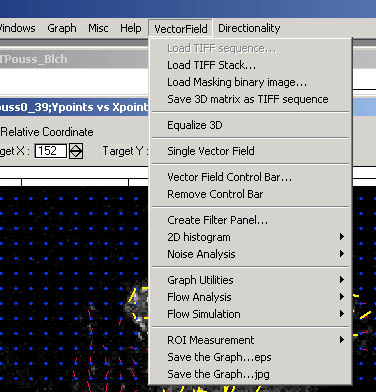
  - Fig. Vector Field analysis menu

###Vector Field Analysis

1. Import a image stack by **[VectorField > Load Tiff Stack]**.

2. Import the image mask in the Vector Filed Analysis Program in the IGORPro. **[VectorField > Load Masking binary image...]**

  - Image Filter can be inverted by [VectorField > 2D histogram > Invert Mask]. This function is sometimes convenient since one might prepare a mask which selects only the background of the sequence.

3. Calculate the vector field by **[VectorField > Single Vector Field]**. In a window that pops-up, select the tiff-stack, input the frame range (normally, I use 30 frames by experience that this is sufficient number of frames). Choose Bleaching Correction “**linear fit**”, if there is a bleaching of the sequence. Other parameters do not have to be changed now. “Averaging” and “Scaling” could be adjusted later after the main calculation.

  - 
  - It takes a while to calculate the vector field. While then there will be a rotating-disc icon indicating that the calculation is going on,
at the right bottom corner of the IgorPro window.
  - 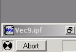 
  - If this calculation is first time in the current igor-experiment, then IgorPro asks you for a path to load noise reference data. 
  - 
  - To set path, click ‘Browse’ button and select “NoiseParameter” folder within Vec9 folder.
  - After the calculation, a new Vector Field window appears.
  - 
  - There will be also two new windows, one for the speed histogram and another for the direction histogram.
  -  

4. To decrease the visualized vectors, adjust the vector scaling and averaging higher. To do so, activate the vector field window and then do **[VectorField >Vector Field Control Bar...]**. This will append a header bar at the top of the vector field plot, and averaging and scaling of vectors could be adjusted interactively.

5. OPTIONAL: Within the Vector Field Control Bar, select “Statistics” from the pull-down menu. Check “relative”, then input the coordinates for the reference points. The coordinates can be measured easily by making a target ROI in the vector field, right click the mouse button within that ROI. A menu will appear and choose “V\_show\_ROI\_center”.

  - 

  - The centroid coordinates of the selected ROI will be printed in the History window. Input those values in “TargetX” and “TargetY”. Clicking “Do it” button will change the measurement of direction of the vectors against the reference point.

  - 

  - The direction histogram changes its range from 0 - 360º
to -180º - +180º. In the latter case, 0º is directed towards the reference point, and ±180º is directed away from the reference point.

  - 

6. OPTIONAL: Filtering. If vector field is influenced by noise largely, these noise derived information must be removed from the measurement. To do so, do **[VectorField > Create Filter Panel...]**. This then pops up a window titled “Filter Panel”. There are several types of filters and you
can set their parameter to remove noise derived vectors.

  - 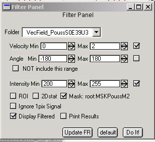

   1. Find the optimum lower and higher limit for the intensity filter (compare the original movie and the vector field). Input the values within the Filter Panel. For selecting intensity range, threshold function in ImageJ is useful **[Image > adjust > threshold]**.
   2. Find the “speed of noise” from the back ground and set the lower limit for the speed detection. Input the value in the Filter Panel.
   3. Set the image-filter by checking the “Mask” check box. A dialogue window will appear. Select the Image Mask from the pull down menu.

   4. Don’t forget to check the “Display Filtered” check box.

   5. Click “Do it” to execute the filtering. After the filtering is done, yellow vectors will appear, which are the vectors after the filtering. Statistics will also change, showing only the results from those yellow vectors.

   6. Filtering parameters can be changed and re-calculated.

7. (Optional) Flow Rate calculation.
  1. Check the background intensity. Move the curser to the background region of the vector field, click right mouse button and select “V\_AverageIntensity” form the menu. The average background intensity will appear in the command window.
  2. Set background intensity by VectorField Flow Analysis Set Background
Intensity.
  3. Do the analysis by VectorField Flow Analysis Calculate Flow. New graphs will appear.

## Appendix

###Appendix 1: Checking the average intensity fluctuation.

**Dealing with Image Sequences with Blinking (Fluctuation of the fl.
Intensity)**

One could measure the temporal changes in the average intensity of frames in the following way uisng ImageJ.

First, open the stack that you want to measure.

Then a macro program should be installed.

**[Plugins Macros Install…]**

Then a popup window appears and a file called “**StackManager.txt**”
must be chosen from wherever it is saved. This file could be downloaded
from

<http://cmci.embl.de/dls/StackManager.ijm>

as well (right click and “save link as”).

You will see new commands in the Macros menu [Plugins > Macros > …].

Activate the Stack window by clicking the title bar, and then select
“**Measure Average Intensity and Plot**” form the macro menu. The
program goes through the sequence once and then there will be a new
window that looks like below.

This plot shows how the average intensity of your sequence changes from
frame to frame. The average intensity is decreasing, because there is a
slight acquisition-photobleaching of the fluorescence.

In some cases, the intensity fluctuates largely. This could be caused by
several reasons such as unstable light source (this happens a lot with
old lamps) or changes in the focus plane. In any case, avoid using such
a sequence, or use only a part of the sequence with a constant intensity
(or with a constant photo-bleaching rate)

###Appendix 2: Enhancing contrast and down scaling from 16 bit to 8bit

This explanation applies to 16-bit image sequences.

Open 16bit Tiff Sequence as a Stack in ImageJ.

Select a frame at a position about 2/3^rd^ of the whole sequence.

Check that the frame is not extraordinarily bright or dark.

**[Analyze > Histogram]**

In a window that pops up, you see an intensity histogram of the image. In general, there is a narrow peak.

Since this is a 16bit image, Grayscale has 65536 (=2^16^) steps between black(0) and white(65535) You need to down scale this and set a full rage in 8 bit, which consists of 256 (=2^8^) steps.

For example, if histogram of a frame distributes in a range of pixel values between 82 and 1009, it means that there are about 900 gray value steps in the image. Although with such a wide dynamic range, the largest peak tends to be in a much narrower range. To determine the intensity range where concerned signal is distributed, you should the peak must be
examined carefully to know if that peak is really your object, or simply background. For this, you could use two different histogram tools: interactive pixel value reading and numerical out put.

**Interactive pixel value reading**: Try moving your curser position
above the histogram window using your mouse. If you let your curser move
across the histogram, you will notice that “Value” at the bottom of the
histogram changes. “Value” means the Gray value, the whiteness of the
pixels. “Count” shows the number of pixels with that gray value. e.g. if
your curser is at “Value” 328 and “Count” is 26, it means that the
number of pixels with a gray value of 328 in the image is 26 pixels. As
you move your curser closer to the peak, “Count” starts to increase.
e.g. the “Value” is 165, “Count” is 435, and so on. Compare the value
readout and actual pixels values in the image to figure out the
background intensity.

As further example, if the tail of the peak is approximately at the
position “Value”=144 (Fig. A2-1). The tail in the other side can be also
determined in a same way. Let’s say “Value”=86 as the other end.

 Fig. A2-1

**Numerical readout**: Click the “List” button in the histogram window.
A list of number appears. This is the actual values of the histogram.
The first column is the “Value” and the second column is the
corresponding “Count” By examining the histogram values, the approximate
steps that contain the peak position can be determined.

16bit images could only be contrast enhanced during conversion to 8-bit.

**[Image > Adjust > Brightness/Contrast]**

This will open a small window with a pixel intensity histogram. Click
“set” button. A small window pops up. Set the “Minimum Displayed Value”
to 86 and the “maximum displayed value” to 144. Now you see that the
Image is contrast enhanced. But don’t be satisfied. The process down to
here have **only changed** **how the image is displayed (LUT)**, not the
image itself. There has been no treatment to the data. This is an
important point, since in many case, one only changes how they are
displayed (or how they appear on the monitor screen) however this is not
a real processing.

To process the image, you need to

**[Image > Type > 8bit]**

This operation converts the image data. You can check that by opening
the histogram again.

**[Analyze > Histogram]**

.. and you see that the peak is nicely distributed between the value 0 and 255.

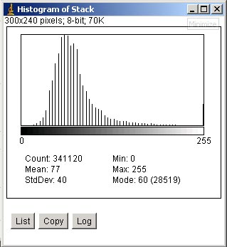 Fig. A2-2

###Appendix 3: Checking the shutter timings.

Some sequences contain “blinking” of the frames. This could be due to

1. Light-source shutter is unstable.
2. Camera shutter is unstable.
3. Light source itself is blinking.
4. focusing position changed.

For the camera shutter stableness, one can go back to the shutter log (“time stamps”) and check if the sequence was taken with a constant shutter timings. Here is an example.

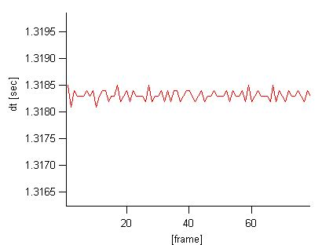 Fig. dt plot generated from the “.tim” file.

For the possibility of that the 3) light source itself was blinking,
this seems to be not convincing because increase/decrease of the bright
ness is rather slow. The blinking of the light source has a higher
frequency.

###Appendix 4: walking average.

Walking averaging of a image sequence converts each frame of the sequence to an average of successive frames. ImageJ macro
(StackManager.txt) ask Kota for a copy.

After installing the macro, ImageJ macro menu looks like this:

If the stack is 8bit, choose “Walking average 8 bit” If 16bit, choose
“Walking average 16 bit”. Then a pop-up window appears:

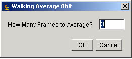

Input number of frames that you want to average, then click “OK”. A new stack appears that is walking averaged.

###Appendix 5: Generating a Image Mask for Vector field.

To make image mask, you need to use ImageJ. First, you must make two
copies of a frame in the sequence you want to analyze. This can be done
by

**[Image > Duplicate…]**

This will create a copy of the frame in the stack. If image is not
8-bit, then convert the image to 8 bit by

**[Image > Type > 8bit]**

Using this duplicated frame, you need to trace the edge of the cell. This is done by selecting freehand tool. Click the freehand ROI icon in the ImageJ menu bar.

Then trace the cell edge like figure shown below left side image.

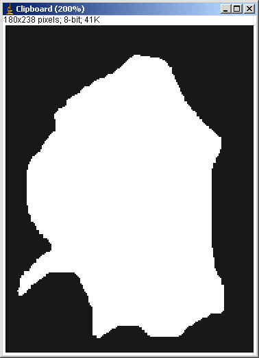

Then after tracing, do

**[Edit > Fill]**

Tip: If inside area of the ROI do not become white, then check color option by [Edit > Options > Color…]. Check that the color assignment shown in the window appeared is like the one shown below.

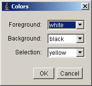

Then

**[Edit > Clear outside]**

This will fill black in the outside area of selected ROI. By these last
two steps, image should have become black and white.

OPTIONAL: masking area inside cell.

Sometimes signal is too high inside cell and this interferes with yourvector analysis. In such a case, another mask could be prepared to mask that high-intensity area, and combine it with the cell edge mask prepared above. You first make another duplicate of a frame by **[image > duplicate]**. Then Trace the high intensity area, and convert them to black ad white just like the first one.

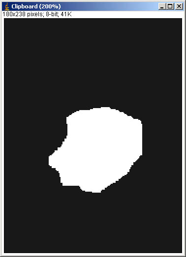

Since we do not want to measure the white area, we invert the image so
that the selected area becomes black.

**[Edit > Invert]**

finally, use Image calculator to combine two masks.

**[Process > Image Calculator…]**

Select the first clipboard as image 1 and the second clipboard as the
image 2. Operation is “Min”. Then the image mask is created and can be
imported from IgorPro.

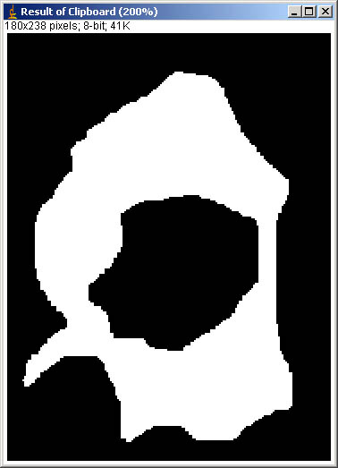

##References

**Horn, B. K. P. and Schunck, B. G.** (1981). Determining Optical Flow.
*Artificial Intelligence* **17**, 185-203.

**Miura, K.** (2005). Tracking Movement in Cell Biology. In *Advances in
Biochemical Engineering/Biotechnology*, vol. 95 (ed. J. Rietdorf), pp.
267. Heidelberg: Springer Verlag.

**Nomura, A., Miike, H. and Koga, K.** (1991). Field theory approach for
determining optical flow. *Pattern Recog. Lett.* **12**, 183-190.

**Teklap, M.** (1995). Digital Video Processing. Englewood Cliffs, N.J.:
Prentice Hall.

[^1]: <http://www.wavemetrics.com>

[^2]: [Sobel filter](http://homepages.inf.ed.ac.uk/rbf/HIPR2/sobel.htm)

